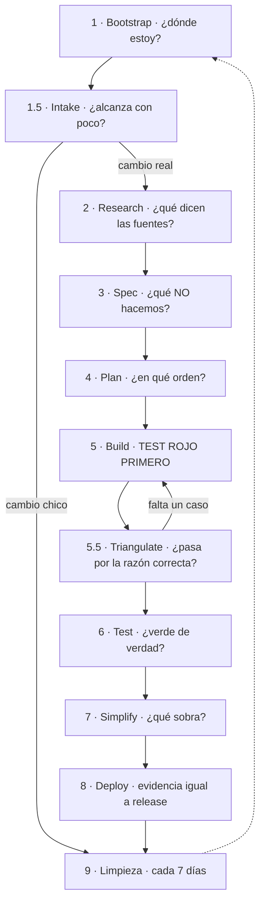
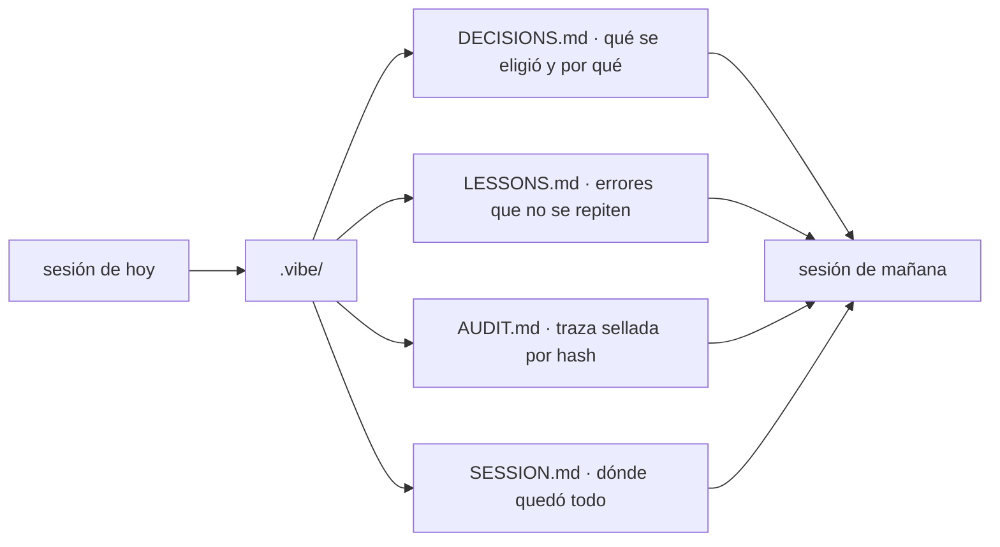
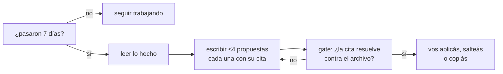

# VibeCodeProtocols (VCP)

**VCP ayuda a una IA a cambiar código sin inventar que revisó, probó o entendió algo.**

No es un linter ni un framework. Es un protocolo: once fases, cada una con un chequeo que se
ejecuta y frena si algo no está. La idea de fondo cabe en una línea:

```text
entender -> decidir -> test rojo -> cambio chico -> casos borde -> revisión -> evidencia -> release
```

> **El repositorio se llama `ia-stack`; el protocolo que vive adentro se llama VibeCodeProtocols.**
> El repositorio se renombró y la skill **no**, porque la invocación `/VibeCodeProtocols` está
> escrita en cada proyecto que ya lo instaló. Una prueba comprueba que este README siga nombrando al
> repositorio donde vive.

---

## El problema que resuelve

Una IA que programa puede decirte «lo probé y anda» sin haber corrido nada. No miente a propósito:
no tiene forma de distinguir lo que ejecutó de lo que supone.

VCP le saca esa ambigüedad. Cada afirmación importante tiene detrás **un comando que la respalda**,
y si el comando no corrió, el protocolo lo dice en vez de seguir.

La regla dura, la que ordena todo lo demás:

> **Sin un test que falle a la vista, no se escribe código.**

---

## Cómo se instala

```bash
./scripts/install.sh --project /ruta/a/mi-proyecto
```

En Windows PowerShell:

```powershell
.\scripts\install.ps1 -ProjectDir C:\ruta\a\mi-proyecto
```

Queda un runtime completo adentro de tu proyecto, en `.vibe/vcp-runtime/`. Reiniciá tu agente,
abrí el proyecto y usá `/VibeCodeProtocols`. Desde ahí los comandos salen de
`.vibe/vcp-runtime/scripts/`, nunca del clone original.

---

## Las once fases



Qué responde cada una, en una línea:

| Fase | Pregunta que responde | Resultado necesario |
|---|---|---|
| 1. Bootstrap | ¿Qué proyecto y qué feature son ésta? | Contexto, estado y feature activa claros |
| 1.5. Intake | ¿Alcanza con un cambio chico o hace falta el ciclo entero? | Triage escrito, con su motivo |
| 2. Research | ¿Qué está roto de verdad, y qué dicen las fuentes? | Fuentes citadas y verificables, no recordadas |
| 3. Spec | ¿Qué problema resolvemos y qué **no**? | Criterios de aceptación y límites |
| 4. Plan | ¿Qué se toca y en qué orden? | Tareas sin dos que escriban lo mismo |
| 5. Build | ¿La conducta está probada **antes** de cambiarla? | Un test rojo visible por cada cambio |
| 5.5. Triangulate | ¿El test pasa por la razón correcta? | Casos borde que lo harían fallar |
| 6. Test | ¿Está todo verde de verdad, o sólo lo que miré? | Suite, cobertura y gates, corridos |
| 7. Simplify | ¿Qué sobra ahora que funciona? | Lo que se saca, con su motivo |
| 8. Deploy | ¿La evidencia coincide con lo que se libera? | Receipt, seguridad y respaldo |
| 9. Limpieza | ¿Qué se acumuló y ya no sirve? | Archivado, nunca borrado, y reversible |

Son las mismas que declara `SKILL.md`. Una prueba lo comprueba: si los dos documentos se separan,
la suite se pone roja.

Cuando una decisión cambia alcance, costo, riesgo o publicación, VCP muestra opciones 🔵. El agente
recomienda una, explica el motivo y espera la decisión humana; no elige por silencio.

---

## La memoria entre sesiones

Una IA arranca cada sesión sin recordar la anterior. VCP no intenta arreglar eso con más contexto:
lo escribe en disco, en `.vibe/`, y lo vuelve a leer al arrancar.



Lo que hace a esa memoria distinta de un archivo de notas: **`AUDIT.md` encadena cada línea con la
huella de la anterior**. Editar algo viejo rompe todo lo que sigue, así que la edición se nota. Y el
chequeo compara esa traza contra la historia de git, que es un ancla que el archivo no controla.

Esa traza **no se rota ni se recorta**: una línea sellada se queda para siempre. Por eso el sellador
tiene un tope de largo hacia adelante — rechaza una línea nueva enorme, y no toca ni un byte de lo ya
escrito.

---

## El bucle de auto-mejora

Cada 7 días, al abrir sesión, el protocolo mira lo que se hizo y propone **como mucho cuatro**
mejoras. El tope es la feature: una lista de veinte no se lee, se archiva.



**No ejecuta nada.** Escribe un archivo en `docs/mejoras/` y ahí termina; el gate rechaza cualquier
registro que traiga un comando adentro, porque un comando en un archivo de propuestas invita a
correrlo sin leerlo.

Cada propuesta tiene que citar el archivo y el texto exacto de donde salió, y el gate **busca ese
texto en ese archivo**. Sin eso, una propuesta es una opinión con formato de hallazgo.

```bash
node scripts/verify-sereno.mjs due              # ¿toca una ronda?
node scripts/verify-sereno.mjs check docs/mejoras/2026-09-04.json
```

**Lo que no puede hacer:** comprueba que la propuesta tenga origen, no que valga la pena. Y que el
texto citado esté ahí, no que signifique lo que la propuesta dice.

---

## Qué garantiza, y qué no

Cada chequeo declara **qué NO puede detectar**, y esas frases están guardadas como datos revisables
en `contracts/honest-limits.json`. No son letra chica: si alguien borra una, el contrato lo rechaza.

La aclaración que vale para todo VCP: **los chequeos prueban forma, cadena y estado, nunca
verdad.** Pueden decirte que una decisión quedó registrada de forma coherente; no pueden decirte que
sea la decisión correcta, ni que la persona la haya entendido.

---

## Diccionario: qué significa cada palabra rara

| Palabra | Qué significa acá |
|---|---|
| **gate** | Un chequeo automático que deja pasar o frena. Un programa que responde sí o no, no una opinión. |
| **verde / rojo** | Verde = pasó. Rojo = frenó. |
| **verde vacío** | Un chequeo que pasó **sin haber comparado nada**, porque el archivo que tenía que mirar no existía. VCP lo escribe distinto: `VACÍO:` en vez de `OK:`. |
| **hash** | Una huella del contenido: un número largo que cambia si cambia un solo carácter. |
| **cadena de hashes** | Cada línea guarda la huella de la anterior. Editar una vieja rompe las que siguen. |
| **receipt** | Dónde queda escrito qué se verificó, con qué comando y qué dio. Evidencia para revisar, no prueba criptográfica. |
| **runtime** | La copia de VCP que vive **dentro** de tu proyecto. Es la herramienta, no tu código. |
| **RED / GREEN** | RED = escribir la prueba primero y **verla fallar**. GREEN = recién ahí, el código que la hace pasar. |
| **límite honesto** | Una frase que dice qué **no** detecta un chequeo, guardada como dato para que nadie la borre sin que se note. |
| **slug** | El nombre corto de una feature: `integridad-verificable`. |

---

## Para leer más

| Documento | Qué tiene |
|---|---|
| **[`SKILL.md`](SKILL.md)** | El protocolo completo, fase por fase. Es lo que lee el agente. |
| **[`skills/gates.md`](skills/gates.md)** | Los 36 chequeos, qué comprueba cada uno y qué no puede comprobar. |
| **[`skills/research.md`](skills/research.md)** | **Research: investigar antes de especificar** — la pasada de Discovery. |
| **[`skills/verificar-vcp.md`](skills/verificar-vcp.md)** | Cómo verificar el propio repositorio de VCP. |
| **[`SECURITY.md`](SECURITY.md)** | **Modelo de seguridad y límites**. |
| **[`INSTALL.md`](INSTALL.md)** | Instalación y desinstalación en detalle. |

Tres comandos que vas a usar seguido, y que viven en el runtime instalado:

```bash
node .vibe/vcp-runtime/scripts/verify-scope-diff.mjs check
node .vibe/vcp-runtime/scripts/verify-graphify-manifest.mjs check
node .vibe/vcp-runtime/scripts/verify-backup-state.mjs check
```

Y el export del grafo, si usás esa integración:
`verify-obsidian-export.mjs check graphify-out/obsidian`.

---

Licencia MIT. Las contribuciones pasan por el mismo protocolo que el código: sin test rojo visible,
no hay implementación.
