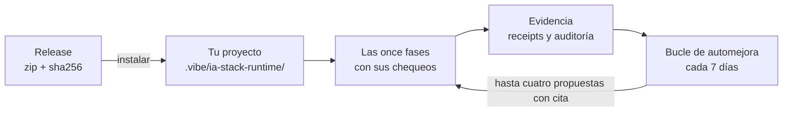
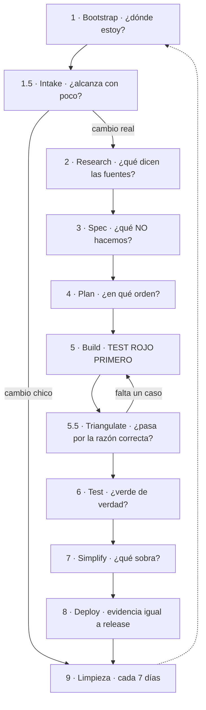
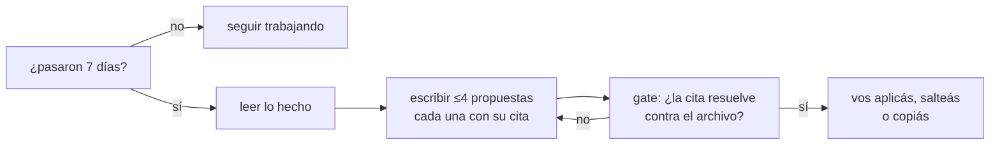

# IA Stack

**IA Stack ayuda a una IA a cambiar código sin inventar que revisó, probó o entendió algo.**

Es un **harness descargable**: una skill para agentes de programación que bajás de la página de
*Releases* e instalás dentro de tu proyecto. Está pensado para desarrollar **webs, PWA y aplicaciones
de escritorio**. No es un linter ni un framework. Trae dos partes:

| Parte | Qué hace |
|---|---|
| **Protocolo** | Once fases, cada una con un chequeo que se ejecuta y frena si algo no está. |
| **Bucle de automejora** | Cada 7 días propone cambios al propio protocolo, con la cita que los respalda. |


```mermaid
flowchart LR
    R["Release<br/>zip + sha256"] -->|instalar| P["Tu proyecto<br/>.vibe/ia-stack-runtime/"]
    P --> F["Las once fases<br/>con sus chequeos"]
    F --> E["Evidencia<br/>receipts y auditoría"]
    E --> S["Bucle de automejora<br/>cada 7 días"]
    S -->|"hasta cuatro propuestas con cita"| F
```

La idea de fondo cabe en una línea:

```text
entender -> decidir -> test rojo -> cambio chico -> casos borde -> revisión -> evidencia -> release
```

> **Se llama IA Stack: el repositorio, el protocolo y la skill.** Hasta el 2026-09-15 el protocolo se
> llamaba `VibeCodeProtocols`. **`/VibeCodeProtocols` sigue andando**: el instalador deja las dos
> invocaciones, con el mismo contenido, para no romper a quien ya lo usaba. Una prueba comprueba que
> este README siga nombrando al repositorio donde vive.

---

## El problema que resuelve

Una IA que programa puede decirte «lo probé y anda» sin haber corrido nada. No miente a propósito:
no tiene forma de distinguir lo que ejecutó de lo que supone.

IA Stack le saca esa ambigüedad. Cada afirmación importante tiene detrás **un comando que la respalda**,
y si el comando no corrió, el protocolo lo dice en vez de seguir.

La regla dura, la que ordena todo lo demás:

> **Sin un test que falle a la vista, no se escribe código.**

---

## Cómo se instala

Desde un clon de este repositorio, o desde la última release, en la página *Releases* de GitHub.
Ahí bajá el archivo **`ia-stack-<versión>.zip`** y su **`.sha256`**. No uses el «Source code (zip)»
que GitHub agrega solo: se llama igual y abre en otra carpeta. Verificalo y descomprimilo en una
carpeta vacía. Sobre una carpeta `ia-stack/` que ya existe se mezclarían dos versiones, y la poda
del instalador no lo arregla.

```bash
sha256sum -c ia-stack-<versión>.sha256        # en macOS: shasum -a 256 -c ia-stack-<versión>.sha256
unzip ia-stack-<versión>.zip && cd ia-stack
```

En PowerShell, el checksum se compara con el del archivo, y tiene que dar `True`:

```powershell
(Get-FileHash ia-stack-<versión>.zip -Algorithm SHA256).Hash -eq ((Get-Content ia-stack-<versión>.sha256) -split '\s+')[0]
```

Adentro, el instalador:

```bash
./scripts/install.sh --project /ruta/a/mi-proyecto
```

En Windows PowerShell:

```powershell
.\scripts\install.ps1 -ProjectDir C:\ruta\a\mi-proyecto
```

Queda un runtime completo adentro de tu proyecto, en `.vibe/ia-stack-runtime/`. Reiniciá tu agente,
abrí el proyecto y usá `/ia-stack` (o `/VibeCodeProtocols`, que sigue andando). Desde ahí los comandos salen de
`.vibe/ia-stack-runtime/scripts/`, nunca del clone original.

---

## Las once fases


```mermaid
flowchart TD
    A["1 · Bootstrap · ¿dónde estoy?"] --> B["1.5 · Intake · ¿alcanza con poco?"]
    B -->|cambio chico| K
    B -->|cambio real| C["2 · Research · ¿qué dicen las fuentes?"]
    C --> D["3 · Spec · ¿qué NO hacemos?"]
    D --> E["4 · Plan · ¿en qué orden?"]
    E --> F["5 · Build · TEST ROJO PRIMERO"]
    F --> G["5.5 · Triangulate · ¿pasa por la razón correcta?"]
    G -->|falta un caso| F
    G --> H["6 · Test · ¿verde de verdad?"]
    H --> I["7 · Simplify · ¿qué sobra?"]
    I --> J["8 · Deploy · evidencia igual a release"]
    J --> K["9 · Limpieza · cada 7 días"]
    K -.-> A
```

Qué responde cada una, en una línea:

| Fase | Pregunta que responde | Resultado necesario |
|---|---|---|
| 1. Bootstrap | ¿Qué proyecto y qué feature son ésta? | Contexto, estado y feature activa claros |
| 1.5. Intake | ¿Alcanza con un cambio chico o hace falta el ciclo entero? | Triage escrito, con su motivo |
| 2. Research | ¿Qué está roto de verdad, qué dicen las fuentes, y qué hay que proteger? | Fuentes citadas y verificables, y la superficie de ataque declarada |
| 3. Spec | ¿Qué problema resolvemos y qué **no**? | Criterios de aceptación y límites |
| 4. Plan | ¿Qué se toca y en qué orden? | Tareas sin dos que escriban lo mismo |
| 5. Build | ¿La conducta está probada **antes** de cambiarla? | Un test rojo visible por cada cambio |
| 5.5. Triangulate | ¿El test pasa por la razón correcta? | Casos borde que lo harían fallar |
| 6. Test | ¿Está todo verde de verdad, o sólo lo que miré? | Suite, cobertura y gates, corridos |
| 7. Simplify | ¿Qué sobra ahora que funciona? | Lo que se saca, con su motivo |
| 8. Deploy | ¿La evidencia coincide con lo que se libera, y la cosa arranca? | Receipt, auditoría, salud comprobada y vuelta atrás escrita |
| 9. Limpieza | ¿Qué se acumuló y ya no sirve? | Archivado, nunca borrado, y reversible |

Son las mismas que declara `SKILL.md`. Una prueba lo comprueba: si los dos documentos se separan,
la suite se pone roja.

Cuando una decisión cambia alcance, costo, riesgo o publicación, IA Stack muestra opciones 🔵. El agente
recomienda una, explica el motivo y espera la decisión humana; no elige por silencio.

---

## El bucle de auto-mejora

Cada 7 días, al abrir sesión, el protocolo mira lo que se hizo y propone **como mucho cuatro**
mejoras. El tope es la feature: una lista de veinte no se lee, se archiva.


```mermaid
flowchart LR
    A["¿pasaron 7 días?"] -->|no| Z["seguir trabajando"]
    A -->|sí| B["leer lo hecho"]
    B --> C["escribir ≤4 propuestas<br/>cada una con su cita"]
    C --> G["gate: ¿la cita resuelve<br/>contra el archivo?"]
    G -->|no| C
    G -->|sí| H["vos aplicás, salteás<br/>o copiás"]
```

**No ejecuta nada.** Escribe un archivo en `docs/mejoras/` y ahí termina; el gate rechaza cualquier
registro que traiga un comando adentro, porque un comando en un archivo de propuestas invita a
correrlo sin leerlo.

Cada propuesta tiene que citar el archivo y el texto exacto de donde salió, y el gate **busca ese
texto en ese archivo**. Sin eso, una propuesta es una opinión con formato de hallazgo.

```bash
node scripts/verify-sereno.mjs due              # ¿toca una ronda?
node scripts/verify-sereno.mjs check docs/mejoras/2026-09-05.json
```

**Lo que no puede hacer:** comprueba que la propuesta tenga origen, no que valga la pena. Y que el
texto citado esté ahí, no que signifique lo que la propuesta dice.

---

## Qué garantiza, y qué no

Cada chequeo declara **qué NO puede detectar**, y esas frases están guardadas como datos revisables
en `contracts/honest-limits.json`. No son letra chica: si alguien borra una, el contrato lo rechaza.

La aclaración que vale para todo IA Stack: **los chequeos prueban forma, cadena y estado, nunca
verdad.** Pueden decirte que una decisión quedó registrada de forma coherente; no pueden decirte que
sea la decisión correcta, ni que la persona la haya entendido.

---

## Diccionario: qué significa cada palabra rara

| Palabra | Qué significa acá |
|---|---|
| **gate** | Un chequeo automático que deja pasar o frena. Un programa que responde sí o no, no una opinión. |
| **verde / rojo** | Verde = pasó. Rojo = frenó. |
| **verde vacío** | Un chequeo que pasó **sin haber comparado nada**, porque el archivo que tenía que mirar no existía. IA Stack lo escribe distinto: `VACÍO:` en vez de `OK:`. |
| **hash** | Una huella del contenido: un número largo que cambia si cambia un solo carácter. |
| **cadena de hashes** | Cada línea guarda la huella de la anterior. Editar una vieja rompe las que siguen. |
| **receipt** | Dónde queda escrito qué se verificó, con qué comando y qué dio. Evidencia para revisar, no prueba criptográfica. |
| **runtime** | La copia de IA Stack que vive **dentro** de tu proyecto. Es la herramienta, no tu código. |
| **RED / GREEN** | RED = escribir la prueba primero y **verla fallar**. GREEN = recién ahí, el código que la hace pasar. |
| **límite honesto** | Una frase que dice qué **no** detecta un chequeo, guardada como dato para que nadie la borre sin que se note. |
| **slug** | El nombre corto de una feature: `integridad-verificable`. |

---

## Para leer más

| Documento | Qué tiene |
|---|---|
| **[`SKILL.md`](SKILL.md)** | El protocolo completo, fase por fase. Es lo que lee el agente. |
| **[`skills/gates.md`](skills/gates.md)** | Todos los chequeos, qué comprueba cada uno y qué **no** puede comprobar. |
| **[`skills/research.md`](skills/research.md)** | **Research: investigar antes de especificar** — la pasada de Discovery. |
| **[`skills/verificar-ia-stack.md`](skills/verificar-ia-stack.md)** | Cómo verificar el propio repositorio de IA Stack. |
| **[`SECURITY.md`](SECURITY.md)** | **Modelo de seguridad y límites**. |
| **[`INSTALL.md`](INSTALL.md)** | Instalación y desinstalación en detalle. |
| **[`docs/guia-completa.md`](https://github.com/santischurmann/ia-stack/blob/main/docs/guia-completa.md)** | La memoria entre sesiones, la autolimpieza, el tablero, las reglas de la suite y lo que cambió en cada versión mayor. Vive en GitHub: el zip no la trae. |

Comandos que vas a usar seguido, todos desde el runtime instalado:

```bash
node .vibe/ia-stack-runtime/scripts/verify-feature-activa.mjs check
node .vibe/ia-stack-runtime/scripts/verify-graphify-manifest.mjs check
node .vibe/ia-stack-runtime/scripts/verify-sereno.mjs due
node .vibe/ia-stack-runtime/scripts/verify-adr.mjs check
node .vibe/ia-stack-runtime/scripts/verify-scope-diff.mjs check --tasks docs/tasks.json --task T01 --base HEAD
node .vibe/ia-stack-runtime/scripts/verify-backup-state.mjs check .vibe/backup.json
```

Una prueba **corre** los comandos de este archivo y falla si alguno muere con `usage:` — hasta el
2026-09-04, dos de los tres que publicaba no arrancaban. Y si usás la integración con un grafo
externo, el export es `verify-obsidian-export.mjs check graphify-out/obsidian`.

---

Licencia MIT. Las contribuciones pasan por el mismo protocolo que el código: sin test rojo visible,
no hay implementación.
